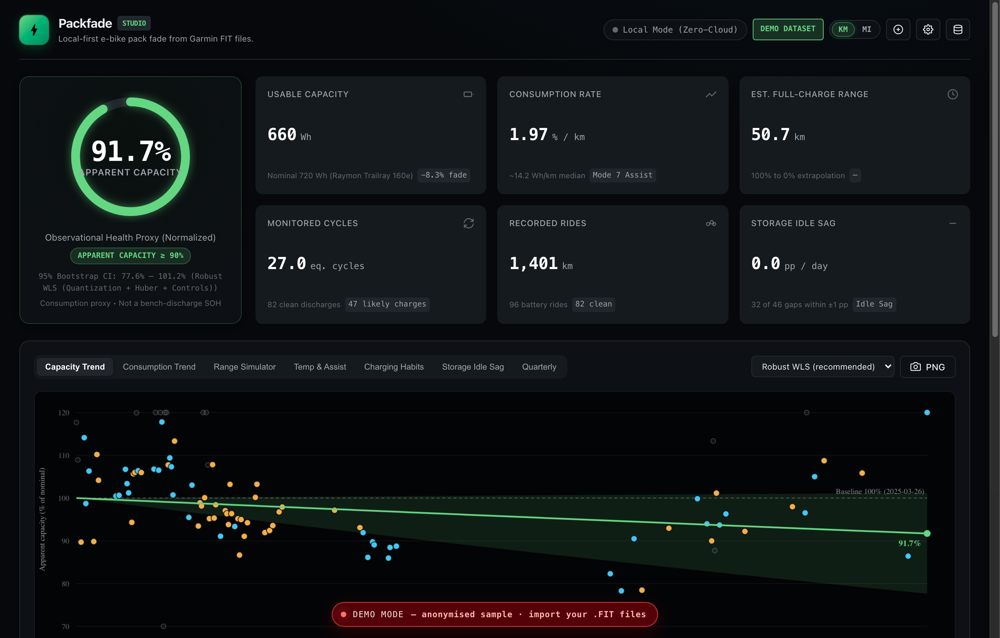
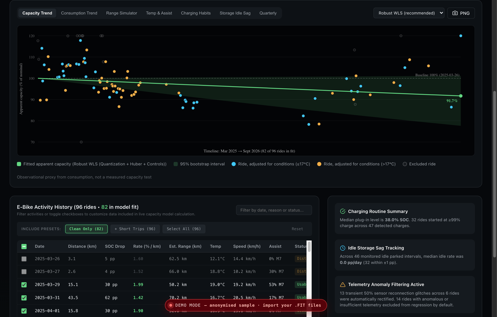
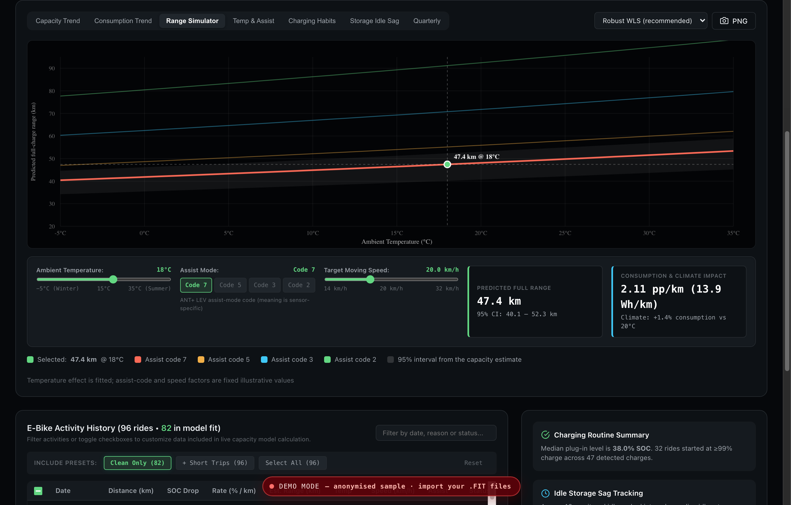
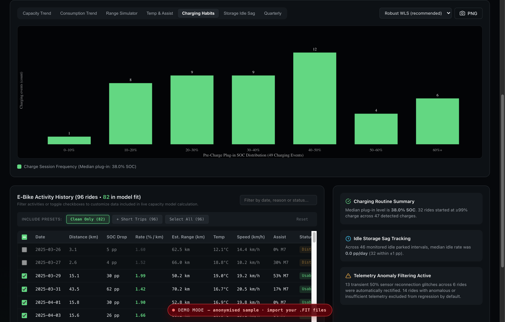
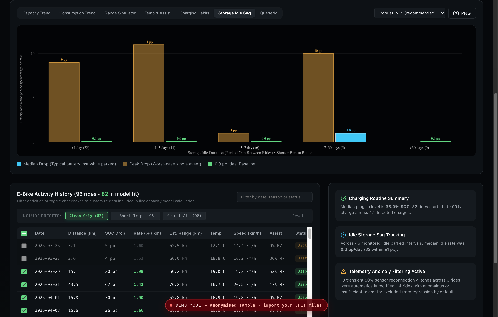
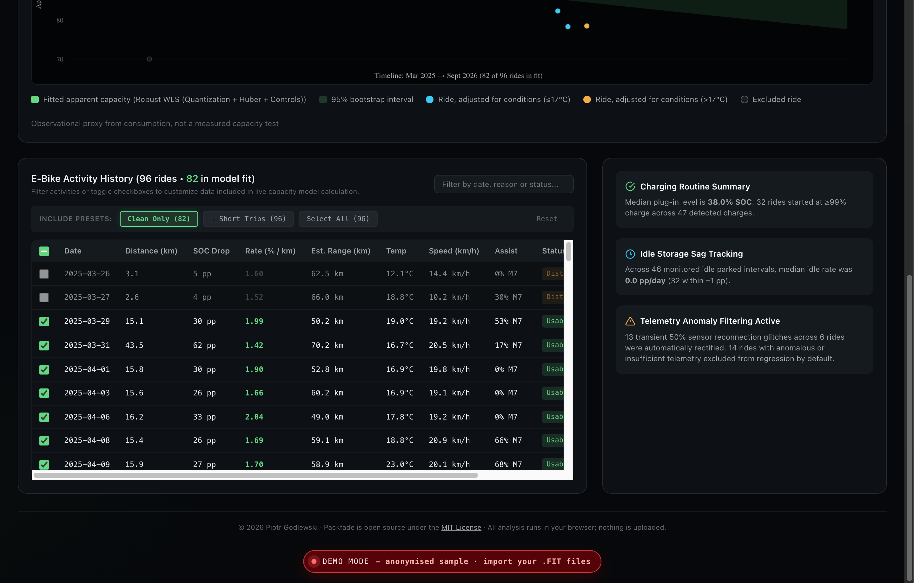
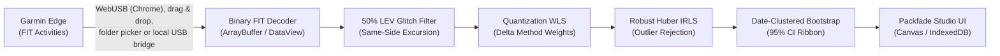

# Packfade

<p align="center">
  
</p>

<p align="center">
  <strong>Local-first e-bike pack fade and apparent capacity tracking from Garmin FIT files.</strong><br>
  Zero-cloud &bull; In-browser binary FIT parsing &bull; Sensor glitch scrubbing &bull; Robust Huber-WLS regression &bull; Date-clustered bootstrap CI
</p>

<p align="center">
  <a href="#tests"></a>
  <a href="#architectural-pipeline"></a>
  <a href="#overview"></a>
  <a href="#tested-hardware--operating-environments"></a>
  <a href="LICENSE"></a>
</p>

---

## Overview

**Packfade** is an open-source, local-first Apparent Capacity Index and pack fade estimation platform for electric bicycles communicating over **ANT+ LEV** (Light Electric Vehicle profile).

Designed as a **100% browser-native single-page application** (`web/index.html`), Packfade operates entirely client-side. All binary Garmin `.fit` decoding, sensor glitch scrubbing, multi-covariate Huber-WLS regression, and clustered bootstrap confidence interval calculations run directly in your browser using pure JavaScript and `ArrayBuffer`/`DataView` APIs, persisting to local IndexedDB (`PackfadeDB`).

> [!NOTE]
> **Zero-Cloud Guarantee**: No telemetry, rides, GPS coordinates, or battery statistics are ever transmitted to any remote server. Your data stays on your machine.
>
> *(The Python tools in `scripts/` served as the research prototype that identified the 50% ANT+ LEV glitch and validated the mathematical model; the browser engine is the canonical runtime and sole source of truth).*

---

## Visual Tour

### 1. Apparent Capacity Index & Degradation Trend

<p align="center">
  
</p>

- **Luminous Health Ring**: Displays the real-time normalized Apparent Capacity Index (e.g. `91.7%`) relative to the fresh pack baseline.
- **KPI Summary Grid**: Instant metrics for usable capacity (`660 Wh` from 720 Wh nominal), normalized consumption rate (`1.97 %/km`), 100% extrapolation full-charge range (`50.7 km`), equivalent full cycles (`27.0 EFC`), total distance (`1,443 km`), and idle sag rate (`0.0 pp/day`).
- **Capacity Trend tab**: Apparent capacity (% of nominal) starting at the configured baseline (default 100% at the baseline date) and falling along the fitted model, with the **95% clustered block bootstrap interval**. Each ride is plotted with its temperature, speed, SOC and assist effects removed, so the points scatter around the fitted line. The EFC model's curve follows cumulative cycles rather than calendar time.
- **Consumption Trend tab**: The raw per-ride consumption (% of battery per km/mi) with the fitted consumption at average conditions. Points are colour-coded by temperature ($\le 17^\circ\text{C}$ cyan, $>17^\circ\text{C}$ gold).

---

### 2. Range & Climate Simulator

<p align="center">
  
</p>

- **Dynamic Temperature Sweep**: Simulates expected total pack range across temperatures ranging from **$-5^\circ\text{C}$ to $+35^\circ\text{C}$**.
- **Assist Mode Sensitivity**: Compares range curves across ANT+ LEV assist-mode codes (7, 5, 3, 2). Code meanings are sensor-specific, and the per-code factors are fixed illustrative values, not fitted.
- **Confidence Band**: Shaded 95% interval carried over from the bootstrap interval of the capacity estimate.

---

### 3. Charging Habits & Depth-of-Discharge (DoD) Distribution

<p align="center">
  
</p>

- **Plug-In SOC Histogram**: Visualizes the State of Charge distribution at which the battery is plugged in (0–10%, 10–20%, ..., 60%+).
- **Battery Longevity Health Tracking**: Identifies whether the pack is predominantly shallow-cycled (prolonging lithium-ion cycle life) or subjected to deep discharges.
- **Top-Up & Full Charge Audit**: Reports median plug-in level (`38.0% SOC`) and monitors how many rides commenced at full $\ge 99\%$ saturation.

---

### 4. Inter-Ride Storage Idle Sag & Self-Discharge

<p align="center">
  
</p>

- **Parked Duration Buckets**: Segmented into `< 1 day`, `1–3 days`, `3–7 days`, `7–30 days`, and `> 30 days`.
- **Peak vs. Median Drop**: Dual-colour bars showing the largest (gold) and median (cyan) SOC drop between rides with no detected charge. This is an apparent change in displayed SOC, not a measured self-discharge rate.
- **Parasitic Loss Detection**: Confirms whether idle storage drain exceeds healthy thresholds (baseline: `0.0 pp/day`, 26 of 40 intervals within $\pm 1$ pp).

---

### 5. Activity Telemetry Audit & Glitch Rectification

<p align="center">
  
</p>

- **Interactive Ride Checkboxes**: Select or deselect individual rides to see instant, live recalculation of the regression fit and capacity index without page reload.
- **Quick Preset Filters**: One-click selection for `Clean Only (82)`, `+ Short Trips (96)`, or `Select All (96)`.
- **50% ANT+ LEV Anomaly Tagging**: Visual `50% Rectified` badges identifying records where uninitialized sensor reconnection dip artifacts were scrubbed.
- **Filtering Reasons**: Distinct tags for `Dist < 8km`, `No Batt Info`, and `Usable` discharges.

---

## Architectural Pipeline



1. **Client-Side Binary FIT Decoder**: Pure JavaScript decoder parses binary Garmin `.fit` records directly into structured time series with zero native dependencies.
2. **50% ANT+ LEV Anomaly Rectification**: Automatically identifies and scrubs bracketed 50% sensor defaults caused by drive units sleeping during pauses while preserving genuine battery crossings.
3. **Quantization-Weighted Least Squares (WLS)**: Employs the Delta Method to model discrete 1% integer quantization variance ($\sigma^2 \propto 1 / d_i^2$), granting 5.1× greater statistical weight to deep 80% discharges over shallow 4% commutes.
4. **Iteratively Reweighted Huber M-Estimation**: Robust against route-specific disturbances (headwinds, soft tires, cargo) solved via in-browser Cholesky linear algebra.
5. **Deterministic Clustered Block Bootstrap**: Resamples multi-stage rides grouped by calendar date using a seeded PRNG for reproducible 95% confidence intervals.
6. **Local Storage**: Persists raw rides, preferences, and fitted coefficients in IndexedDB (`PackfadeDB`).
7. **Metric / Imperial Unit Conversion**: Dynamic `[KM | MI]` toggle in top bar and bike profile modal converts distances, speeds (`km/h` vs `mph`), consumption rates (`%/km` vs `%/mi`), and ranges seamlessly without altering underlying model invariants or requiring server roundtrips.

---

## Tested Hardware & Operating Environments

| Component | Specification |
|---|---|
| **E-Bike** | Raymon Trailray 160e (Full-suspension e-MTB) |
| **Drive Unit** | Yamaha PW-X3 (85 Nm peak torque) |
| **Battery Pack** | Simplo 720 Wh internal lithium-ion pack (36V nominal) |
| **Head Units** | Garmin Edge 1040, Garmin Edge 840 (USB MTP mode) |
| **Protocol** | ANT+ LEV (`ebike_battery_level`, `ebike_assist_mode`, `ebike_travel_range`) |
| **Field Dataset** | 96 real-world activities (Mar 2025 – Sep 2026), 1,442.8 km, 27.0 EFC, 82 verified clean discharges |
| **Browsers** | Google Chrome, Apple Safari |
| **Platforms** | macOS (MacBook). Other platforms and browsers are untested. |

---

## Quickstart

### Option 1: Try the live demo

👉 **[pgodlews.github.io/packfade](https://pgodlews.github.io/packfade/)**: no install.

The demo opens with 96 sample rides from the reference bike. Their dates are anonymised: every ride starts at 00:00 UTC and has been shifted by up to ±3 days. You can also drop your own `.fit` files onto the page. They are decoded and analysed in your browser and stored only in that browser's IndexedDB; nothing is uploaded. In Chrome you can also import straight from a connected Edge via **Connect / Import → Garmin Edge over WebUSB** (read-only). The Python-bridge **Sync USB Edge** button only appears when running locally (see Option 3).

### Option 2: Run locally (no install)

```bash
git clone https://github.com/pgodlews/packfade.git
cd packfade
python3 -m http.server 8080 -d web
# Then open http://localhost:8080
```

Opening `web/index.html` directly (`open web/index.html` on macOS, `xdg-open` on Linux) also works. `localhost` is recommended, because the folder picker needs a secure context.

Garmin Edge 1040/840 units connect over MTP and don't mount as a folder on macOS. In Chrome, use **Connect / Import → Garmin Edge over WebUSB** to pick the Edge and read its activities directly (read-only). In Safari, copy the `.fit` files out first (for example with OpenMTP or Garmin Express), or use Option 3.

### Option 3: Local USB sync from a Garmin Edge

Reads activities straight off a connected Edge. It is read-only and never writes to the device. It needs Python 3.12 and `libmtp` (`brew install libmtp pkg-config` on macOS):

```bash
python3 -m venv .venv && .venv/bin/pip install -r requirements.lock
sh scripts/build_usb.sh                      # builds build/pull_edge
PYTHONPATH=. .venv/bin/python scripts/serve_web.py
# Then open http://localhost:8080. The "Sync USB Edge" button appears once the local bridge is detected.
```

### Using the Studio

1. **Import Rides**: Drag and drop Garmin `.fit` files onto the page, pick a folder, or (Option 3) click **"Sync USB Edge"**.
2. **Explore the Demo**: The anonymised 96-ride demo loads on first visit (red **Demo mode** banner). Importing your own files offers to start a clean Personal Pack.
3. **Toggle Units**: Switch between Kilometers and Miles using the `[KM | MI]` header toggle.
4. **Export Reports**: Export PNG charts or backup your database as JSON with one click.

---

## Offline Python Research Tools (POC)

The original Python research scripts remain available for headless batch processing, data archiving, and offline econometric replication:

```bash
# Multi-covariate Huber-WLS degradation analysis
PYTHONPATH=. .venv/bin/python scripts/analyze_ebike_battery.py

# Inter-ride charging habits & storage idle sag analysis
PYTHONPATH=. .venv/bin/python scripts/analyze_ebike_charging.py

# Or via the CLI runner (after `.venv/bin/pip install -e .`):
packfade analyze
packfade charging
```

Outputs are written to `reports/ebike_battery/` (`analysis.json`, `charging_profile.json`, SVG and PNG degradation plots).

---

## Documentation

- **[docs/MATHEMATICAL_MODEL.md](docs/MATHEMATICAL_MODEL.md)**: Derivation of WLS quantization weighting, Huber IRLS, date-clustered bootstrap, Arrhenius temperature sensitivity, and econometric identification limitations.
- **[docs/ANT_PLUS_BATTERY_ANOMALIES.md](docs/ANT_PLUS_BATTERY_ANOMALIES.md)**: Physical relaxation vs digital glitch distinction, same-side excursion rectification, and ANT+ LEV profile specifications.
- **[docs/CUSTOMISATION.md](docs/CUSTOMISATION.md)**: Adapting Packfade to different e-bikes, hub motors, regeneration, assist levels, and custom battery sizes.
- **[AGENTS.md](AGENTS.md)**: Architectural guidelines and contributor development rules.

---

## Tests

Packfade includes a comprehensive 28-test automated suite covering binary parsing, glitch filtering, mathematical model parity, unit conversion, and web security:

```bash
PYTHONPATH=. .venv/bin/pytest -v
```

```
============================== 28 passed ==============================
```

---

## License

Copyright © 2026 Piotr Godlewski. Released under the MIT License; see [LICENSE](LICENSE).
